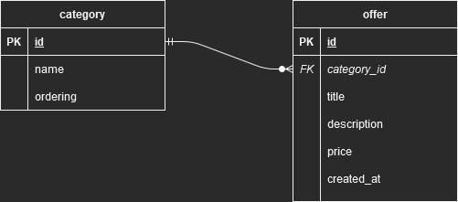

# AdvertisementsAPP

Project for recruitment and Django Rest Framework learning purposes.

Simulates a simple portal with advertisements.

## Setup

1. Fill in required details in *.env* and *database.ini* files (use *\<file>.example* for reference) - **recommended to
   use *DJANGO_EXTERNAL_PORT=8001* in *.env*** to avoid an additional step:

> * Provided Angular website uses static *api_url*, so if you want to use custom *api_url* you need to manually change value of *this.http.get("http://host.docker.internal:8001/offers?format=json")* in *.angular/AdvertisementsAngular/dist/AdvertisementsAngular/main.\*.js* file

2. Docker compose (*docker-compose up -d*)

## Entity-Relationship Diagram

## Skills used

- created a functioning API with CRUD functionality in Django Rest Framework
- learned and applied DRF utilities
- implement option to docker compose PostgreSQL and Django app instances
- provided end2end RestAPI endpoints tests in a Postman collection
- developed a Single Page Application in Angular

### Possible improvements

- properly learn how to develop on frontend side (I have planned to complete
  the [Microsoft Web-Dev Course](https://github.com/microsoft/Web-Dev-For-Beginners))
- improve project structure (organize the code into controllers, services, etc.)
- provide a more user-friendly display for offer category in text, rather than related id
- implement authorization to restrict database access for manipulating functions